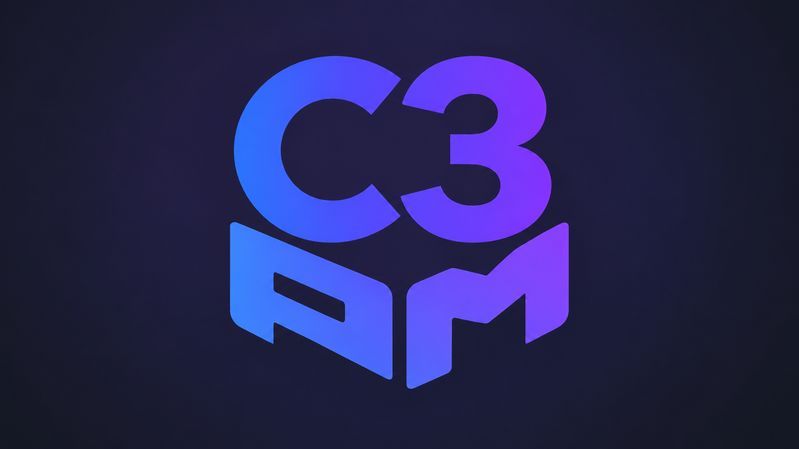

# c3pm — Package Manager for the C3 Programming Language

<p align="center">
  
</p>

`c3pm` is a Nix-backed package manager and reproducible build environment for the C3 programming language and `c3c` compiler.

It reads the standard C3 dependency graph and adds `vendor.c3pm` metadata for sources, toolchains, and native packages. c3pm uses those inputs to create a reproducible development and build environment.

> [!WARNING]
> **Current supported platform: Linux x86_64.**

> [!NOTE]
> **Default nixpkgs target:** nixpkgs-unstable.
> **Default C3 target:** C3 0.8.4.

Released c3pm binaries are standalone static executables. Running c3pm itself does **not** require C3 or a compatible system libc. Nix remains a separate backend: c3pm can use your existing installation or manage `nix-portable` for you.

[](https://asciinema.org/a/U3d5pHHQY7fR1mgZ)

The demo demonstrates how c3pm:

- searches the default package registry;
- resolves the unique package name `raylib` to `vendor/raylib`;
- installs its pinned C3 and native dependencies;
- builds a raylib application inside the reproducible development shell.

## Quick start

### 1. Install c3pm

Run the installer for the latest release:

```sh
curl --fail --location https://c3pm.dev/install.sh | sh -
```

### 2. Build a raylib hello world

With `c3c` available on your `PATH`, create a new C3 project:

```sh
c3c init raylib_hello
cd raylib_hello
```

Search the registry and add raylib by its unique package name:

```sh
c3pm search raylib
c3pm add raylib
```

Replace `src/main.c3` with:

```c3
module raylib_hello;

import raylib6::rl;

fn void main()
{
	rl::init_window(800, 450, "raylib hello");
	defer rl::close_window();
	rl::set_target_fps(60);

	while (!rl::window_should_close())
	{
		rl::begin_drawing();
		rl::clear_background(rl::RAYWHITE);
		rl::draw_text("Hello, raylib!", 290, 210, 32, rl::DARKBLUE);
		rl::end_drawing();
	}
}
```

Build and run it inside the resolved development environment:

```sh
c3pm shell -- c3c run
```

The application opens an 800×450 window displaying “Hello, raylib!”. Press Escape or close the window to exit.

With the portable Nix backend, the first Nix operation initializes `nix-portable` and may fetch the inputs in [`.c3pm/nix/flake.lock`](https://c3pm.dev/docs/reference/lock-file/). Later commands reuse that store and lock.

## Documentation

- [Installation and Nix setup](https://c3pm.dev/docs/getting-started/installation/)
- [How c3pm works](https://c3pm.dev/docs/getting-started/how-it-works/)
- [Search and add packages](https://c3pm.dev/docs/guides/packages/)
- [Package C3 libraries](https://c3pm.dev/docs/guides/packaging/)
- [Manage registries](https://c3pm.dev/docs/guides/registries/)
- [Link native libraries and projects](https://c3pm.dev/docs/guides/linking/)
- [Configure toolchains](https://c3pm.dev/docs/guides/toolchains/)
- [Build and run](https://c3pm.dev/docs/guides/build/)
- [Create portable bundles](https://c3pm.dev/docs/guides/bundles/)
- [CLI reference](https://c3pm.dev/docs/reference/cli/)
- [Metadata reference](https://c3pm.dev/docs/reference/metadata/)
- [Registry format reference](https://c3pm.dev/docs/reference/registry/)

## Examples

The [SQLite todo application](examples/sqlite-example) demonstrates C3 bindings, native dependencies, and a portable bundle. Follow the [walkthrough](https://c3pm.dev/docs/examples/sqlite/).

## Contributing

See [Build c3pm from source](https://c3pm.dev/docs/contributing/build-from-source/) for building, testing, and previewing the documentation.

## License

MIT. See [LICENSE](LICENSE).
